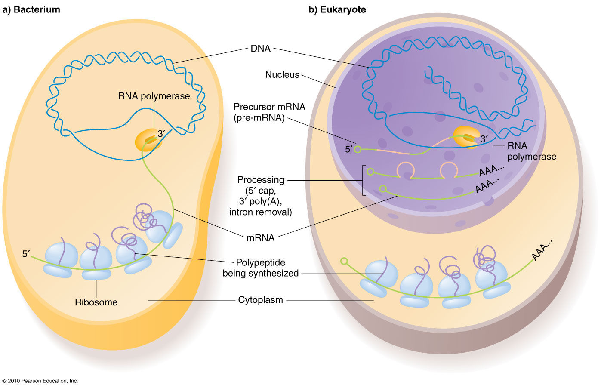

```{r setup, include=FALSE}
knitr::opts_chunk$set(echo = TRUE)
knitr::opts_chunk$set(warnings = FALSE)
knitr::opts_chunk$set(message = FALSE)

library(DT)
library(tidyverse)

ppi = read_tsv("data/ppi.sif", col_names = F)
colnames(ppi) = c("bait", "interaction", "protein")
ppiFunCat = read_tsv("data/ppiFunCat.tsv")
```

# Introduction

In this session we will cover a few topics on data visualization.

**1.** We are going to reproduce a protein-protein interaction network I've made for a paper published recently. For that, we are going to use Cytoscape.

**2.** We will explore different types of variables and plot them using the R language environment. More specifically we will use RStudio Cloud and a package called `ggplot2`.

# Network visualization using Cytoscape

## Context

In deLomana et al. [2020], we studied a few aspects of _Halobacterium salinarum_ translational regulation. One of the questions we needed to answer to support one of our hypotheses was:

* Is transcription and translation coupled in _H. salinarum_?

We know that transcription and translation happen in different compartments in the eukaryotic cell: Transcription happens inside the nuclei. Translation happens in the cytoplasm.

In the prokaryotic cell, we don't have a membrane to separate the genetic material from the cytoplasm, so transcription and translation are likely to happen simultaneously. Coupled transcription and translation is a fact in Bacteria. But what about Archaea?

```{r transcriptionTranslation, out.width = "800px", echo = F}

```

Source: https://www.mun.ca/biology/scarr/iGen3_05-09.html  

In the Baliga Lab, a few years ago, Mark Facciotti and his colleagues performed a target coimmunoprecipitation experiment to find out what were the proteins coupled to specific proteins of the transcription machinery, the general transcription factors of _H. salinarum_. [Facciotti et al. 2007].

Using those results, we checked if proteins of the translational machinery were present in the pulldown fractions when transcription proteins were used as baits. Indeed, we were able to find a few, supporting our hypothesis of coupled transcription and translation:

```{r ppiFig, out.width = "500px", echo = F}
knitr::include_graphics("img/ppiFig.jpg")
```

RPs physically interact with transcription complex components. Diamonds represent RPs; squares represent transcription complex components. Tagged proteins used as bait in the immunoprecipitation experiment are highlighted by a black border. Arrowheads link bait to coimmunoprecipitated proteins. We labeled each of the seven modules obtained by the Newman-Girvan clustering algorithm using a different color [de Lomana et al., 2020].

## Data structure

### Protein-protein interaction network

This is the structure of a Simple Interaction File (SIF) 

```{r ppiData, echo = F}
datatable(ppi)
```

### Protein information

```{r proteinInfo, echo = F}
datatable(ppiFunCat)
```

## Installing Cytoscape and apps (or plugins)

**1.** Go to the Cytoscape [download page](https://cytoscape.org/download.html). Download and install it.  

**2.** Open Cytoscape program and install the following apps:  

  + clusterMaker2  
  `Apps -> App Manager -> Search: clusterMaker2 -> Select listing -> Click on Install button`  
  + Color Cast  
  `Apps -> App Manager -> Search: Color Cast -> Select listing -> Click on Install button`  
  + yFiles Layout Algorithms  
  `Apps -> App Manager -> Search: yFiles -> Select listing -> Click on Install button`  

## Plotting a protein-protein interaction network

**1.** Import the protein-protein interaction file `ppi.sif`.  
`File -> Import -> Network from URL ->`  
`https://alanlorenzetti.github.io/dataVisSession2020/data/ppi.sif`

**2.** Import the protein information table.  
`File -> Import -> Table from URL ->` 
`https://alanlorenzetti.github.io/dataVisSession2020/data/ppiFunCat.tsv ->`  
`Where to Import Table Data: To selected networks only -> Click on OK button`

**3.** Click on `Style` tab. Let's change the design of our network.

  + Select the `Sample1` preset style.
  + Change the label of nodes by selecting the `label` column.
  + Change the shape of nodes according to the functional `class` of proteins. Rectangles will represent `Transcription` class. Diamonds will represent `Translation` class.
  + Add a thick border to the nodes of proteins used as baits. Set size `2`.
  + Make the nodes bigger. Select size `35`.
  + Click on the `Edge` tab. Make the edges thicker (size `1.5`) and `black`.
  + Add arrowheads (`Target Arrow Shape; Delta`) to the end of edges.
  + Remove edge labels.
  
**4.** Apply the Newman-Girvan modularity algorithm to find modules of highly interconnected proteins. Use the default parameters.
`Apps -> clusterMaker -> Community Cluster (GLay)`

**5.** Change the color of nodes according to the modules. We will use a plugin called `Color Cast` to make our lives easier. Select `__glayCluster` as the target data column. We'll apply the `Set2` colors.
`Tools -> Color Cast -> Color Cast`

**6.** Remove all the nodes not classified as `Transcription` or `Translation`.

  + Using the `Node Table` panel, order the class column and select all proteins of those classes.
  + Then right-click the selection and then click on `Select nodes from selected rows`.
  + Hide the unselected nodes. `Select -> Nodes -> Hide Unselected Nodes`.
  
**7.** Apply an automatic layout.

  + Select all proteins used as baits (those with borders).
  + Apply `yFiles Hierarchic Layout Selected Nodes`. `Layouts -> Hierarchic Layout Selected Nodes`.
  
**8.** Save your network and export as an image file.

  + `File -> Save`
  + `File -> Export -> Network to Image`

# Data visualization in R using the `ggplot2` package

## Installing `ggplot2` package

```{r install, eval=F}
# installing ggplot2 package
install.packages("ggplot2")
```

## Loading libs and the table we will work with

```{r loadLibs}
# loading ggplot2
library(ggplot2)
theme_set(theme_bw())

# loading our dataframe
haloExp = read.delim("https://alanlorenzetti.github.io/dataVisSession2020/data/haloExpression.tsv")
```

## Variable types

### Discrete variables

* Counts:  

  + The number of times you cursed this damn virus this week (5)
  + Number of stars in the Milky Way (250 billion or 2.5 x 10^11)
  + Number of genes in a compact genome (2600)
  + Number of messenger RNA molecules in a bacterial cell (~1800) [Moran et al. 2013]
  + Length of a messenger RNA (1573 nucleotides)

### Continuous variables

* Measures:

  + Height of an individual (162.56 centimeters) 
  + Weight of an individual (89.77 kilograms)
  + mRNA expression (1401.75 arbitrary expression unit)
  + Protein expression (1500.62 arbitrary expression unit)

* Ratios:  

  + GC content, i.e., frequency of Guanine or Cytosine bases in a transcript (e.g. 973/1573 = 0.619)
  

### Categorical variables

* Characteristics:  
  + Color of eyes (black, brown, blue, green, red)
  + Biological process of a protein (Transcription, Cell Motility, Function unknown, etc).
  + Transcript length (short, mid, long)

## Data structure

```{r dataStructure, echo=F}
datatable(haloExp)
```

## Syntax

`ggplot(data = <YOUR_DATASET_HERE>, aes(x = <X_AXIS_VARIABLE>, y = <Y_AXIS_VARIABLE>))`  
+  
`geom_<TYPE_OF_CHART>`  
+  
`additional modifications`

```{r syntax, echo=F, include = F}
knitr::include_graphics("img/ggplotSyntax.png")
```

## Visualizations

What kind of plot is suitable to my data? We have to think about the i) number of variables, ii) the type of variables, and iii) the goal of the visualization.

### One variable (continuous or discrete)

#### Histogram

```{r histogram}
# plotting a histogram of transcript length
ggplot(data = haloExp, mapping = aes(x = length)) +
  geom_histogram()
```

#### Density curves

```{r density}
# plotting the density curve of transcript length
ggplot(data = haloExp, mapping = aes(x = length)) +
  geom_density()
```

```{r densityColor}
# plotting density curves for each one of the transcript length categories
ggplot(data = haloExp, mapping = aes(x = length, color = length_category)) +
  geom_density()
```

```{r densityColorFacet, fig.width = 10}
# plotting density curves for each one of the transcript length categories
# one panel per legnth category
ggplot(data = haloExp, mapping = aes(x = length, color = length_category)) +
  geom_density(show.legend = FALSE) +
  facet_wrap(~ length_category)
```

### One variable (categorical)

#### Bar plots 

```{r bar}
# plotting a bar chart for the protein biological classes
ggplot(data = haloExp, mapping = aes(x = biological_class)) +
  geom_bar() +
  coord_flip()
```

```{r barColor}
# plotting a bar chart for the protein biological classes
# colors were added to distinguish each one of the classes
ggplot(data = haloExp, mapping = aes(x = biological_class, fill = biological_class)) +
  geom_bar(show.legend = FALSE) +
  coord_flip()
```

### Two variables (x = continuous or discrete; y = continuous or discrete)

#### Scatter plots

```{r scatter, message = F, warning = F}
# plotting a scatter plot of protein expression in function of mRNA expression
ggplot(data = haloExp, mapping = aes(x = mRNA_expression, y = protein_expression)) +
  geom_point()
```

```{r scatterTrend, message = F, warning = F}
# plotting a scatter plot of protein expression in function of mRNA expression
# a trend line was added to show the linear correspondence of both
ggplot(data = haloExp, mapping = aes(x = mRNA_expression, y = protein_expression)) +
  geom_point() +
  geom_smooth(method = "lm")
```

```{r scatterTrendFacet, fig.width = 10, message = F, warning = F}
# plotting a scatter plot of protein expression in function of mRNA expression
# a trend line was added to show the linear correspondence of both
# plots were separated in panels according to the transcript length category
ggplot(data = haloExp, mapping = aes(x = mRNA_expression, y = protein_expression)) +
  geom_point() +
  geom_smooth(method = "lm") +
  facet_grid(~ length_category)
```

```{r scatterGC, message = F, warning = F}
# plotting a scatter plot of protein expression in function of mRNA expression
# colors were added according to the GC content of the transcripts
ggplot(data = haloExp, mapping = aes(x = mRNA_expression, y = protein_expression, color = GC)) +
  geom_point()
```

### Two variables (x = categorical; y = continuous or discrete)

#### Boxplot

[What is a box plot?](https://en.wikipedia.org/wiki/Box_plot)

```{r boxplot}
# plotting a boxplot of GC content for the transcripts
# separated by biological classes
ggplot(data = haloExp, mapping = aes(y = GC, x = biological_class)) +
  geom_boxplot() +
  coord_flip()
```

### Two variables (x = categorical; y = categorical)

#### Count plot

```{r countPlot}
# plotting a count plot of length category and biological class
ggplot(data = haloExp, mapping = aes(y = length_category, x = biological_class)) +
  geom_count() +
  coord_flip()
```

### Several variables of different types

#### 3D scatter plots (x, y, z = continuous or discrete)

```{r scatter3d, echo = F, message = F, warning = F}
# https://fuzzyatelin.github.io/bioanth-stats/module-26/Module-26.html#an_interactive_3d_scatterplot
library(plotly)
attach(iris)
scatter3d = plot_ly(data = iris,
                    x=Sepal.Length,
                    y=Sepal.Width,
                    z=Petal.Length,
                    type="scatter3d",
                    mode='markers',
                    color=Species)

plotly::layout(scatter3d)
```

#### Heat maps (continuous, discrete, and categorical variables altogether)

```{r heatmap, out.width = "400px", echo = F}
knitr::include_graphics("img/figureSpectronaut.png")
```

## Exercise

* What other combinations of variables we can explore using the given dataset?

# Resources

* [RStudio IDE cheatsheet](https://github.com/rstudio/cheatsheets/raw/master/rstudio-ide.pdf)
* [`ggplot2` cheatsheet](https://github.com/rstudio/cheatsheets/raw/master/data-visualization-2.1.pdf) 

# References 

DE LOMANA, A. et al. Selective Translation of Low Abundance and Upregulated Transcripts in Halobacterium salinarum. mSystems, v. 5, n. 4, 28 jul. 2020.

FACCIOTTI, M. T. et al. General transcription factor specified global gene regulation in archaea. Proceedings of the National Academy of Sciences of the United States of America, v. 104, n. 11, p. 4630–4635, 13 mar. 2007.

MORAN, M. A. et al. Sizing up metatranscriptomics. The ISME Journal, v. 7, n. 2, p. 237–243, fev. 2013.